# Uso de Terraform

En esta práctica realizaremos la creación y eliminación de la infraestructura de la práctica 07 (un frontend junto a un backend) y de la práctica 09 (un balanceador, dos frontend, un backend y un NFS Server) mediante [Terraform](https://www.terraform.io/)

Crearemos un repositorio el cuál clonaremos en nuestra máquina y crearemos la siguiente estructura de directorios y archivos:

+ **ejercicios**

  + **iaw-practica-07**
    + main.tf

  + **iaw-practica-09**
    + main.tf

## Instalación de Terraform

La instalación de **Terraform** varía según el sistema operativo --> [Instalación de Terraform](https://developer.hashicorp.com/terraform/downloads)

Una vez se haya realizado la instalación de Terraform, hay que comprobar que está instalado y en la última versión del momento:

```bash
terraform --version
```

## main.tf de iaw-practica-07

Dentro de este directorio **crearemos el archivo main.tf que nos permitirá tanto crear como eliminar la infraestructura** mediante varios comandos.

Empezaremos definiendo el proveedor que vamos a usar mediante provider "aws" y dentro de la llave definiremos la región en la que estamos, **en el caso de Learner Lab Foundation Services, sería la us-east-1**.

```tf
provider "aws" {
  region = "us-east-1"
}
```

Empezaremos definiendo los recursos que vamos a tener, primero realizaremos los grupos de seguridad y el primer grupo de seguridad será el de la instancia frontend. Tenemos que usar **resource "aws_security_group"** para especificar que es un recurso de tipo grupo de seguridad y después **"sg_frontend"** para decir cuál será el nombre del recurso.

Dentro de las llaves tenemos *name* que nos permite especificar el nombre que tiene el grupo de seguridad, también con *description* especificaremos la descripción para el grupo de seguridad, después con *ingress* especificaremos las reglas de entrada que tendrá el grupo de seguridad, como es un frontend sin balanceador de carga, necesitará el puerto TCP de SSH (22), de HTTP (80) y de HTTPS (443). Deberemos tener un *ingress* por cada puerto que queremos abrir.

De igual forma, estableceremos el grupo de seguridad del backend para los puertos TCP de SSH (22) y MySQL / Aurora (3306)

```tf
resource "aws_security_group" "sg_frontend" {
  name        = "sg_frontend"
  description = "Grupo de seguridad para los frontales sin balanceador de carga"

  ingress {
    from_port   = 22
    to_port     = 22
    protocol    = "tcp"
    cidr_blocks = ["0.0.0.0/0"]
  }

  ingress {
    from_port   = 80
    to_port     = 80
    protocol    = "tcp"
    cidr_blocks = ["0.0.0.0/0"]
  }

  ingress {
    from_port   = 443
    to_port     = 443
    protocol    = "tcp"
    cidr_blocks = ["0.0.0.0/0"]
  }
}
```

Después de los grupos de seguridad, estableceremos las instancias para ello, **usaremos un recurso de tipo aws_instance**. Dentro del recurso tenemos *ami* para especificar el ID de la AMI que vamos a usar, en este caso de Ubuntu Server 22.04, también usaremos *instance_type* para especificar la cantidad de memoria RAM que tendrá la instancia, con *security_groups* especificaremos el grupo de seguridad que hemos establecido al principio, primero el tipo de recurso, *aws_security_group*, después *el nombre del recurso* que hemos establecido junto al tipo de recurso y el nombre que hemos establecido dentro del recurso. A continuación estableceremos el nombre del archivo de claves para realizar la conexión mediante SSH y por último mediante *tags* y *Name* el nombre que tendrá la instancia.

```tf
resource "aws_instance" "iaw_practica_07_frontend" {
  ami             = "ami-00874d747dde814fa"
  instance_type   = "t2.medium"
  security_groups = [aws_security_group.sg_frontend.name]
  key_name        = "vockey"

  tags = {
    Name = "iaw-practica-07-frontend"
  }
}
```

Por último, estableceremos dos recursos, el primero, *aws_eip*, para obtener una IP elástica y después asignar la IP elástica a la instancia frontend mediante *instance*, el tipo de recurso, *iaw_practica_07_frontend* y el *id* de la instancia.

Por último, usaremos un recurso para mostrar la IP elástica que se ha asignado a la instancia elástica.

```tf
resource "aws_eip" "ip_elastica_frontend" {
  instance = aws_instance.iaw_practica_07_frontend.id
}

# Se muestra la IP elástica de la instancia frontend
output "elastic_ip" {
  value = aws_eip.ip_elastica_frontend.public_ip
}
```

### Preparación de Terraform

Una vez hayamos finalizado el archivo, **inicializaremos el entorno de Terraform desde la ruta en la que se encuentra el archivo main.tf** mediante:

```bash
terraform init
```

Cuando se inicialice correctamente el entorno, formatearemos el contenido del archivo con el comando:

```bash
terraform fmt
```

De esta forma si se realizan cambios en algún archivo de Terraform, nos lo notificará desde la terminal los archivos que han sufrido cambios.

### Ejecución del archivo main.tf

Para ejecutar el archivo de Terraform, necesitamos actualizar el archivo de credenciales de AWS CLI, por lo que una vez las hayamos actualizado, ejecutaremos:

```bash
terraform apply
```

Con este comando nos mostrará la infraestructura y los valores que tendrá además de los que hemos establecido en el archivo **main.tf**. Después nos preguntará si queremos realizar las acciones anteriormente descritas, introduciremos *yes* para crear la infraestructura.

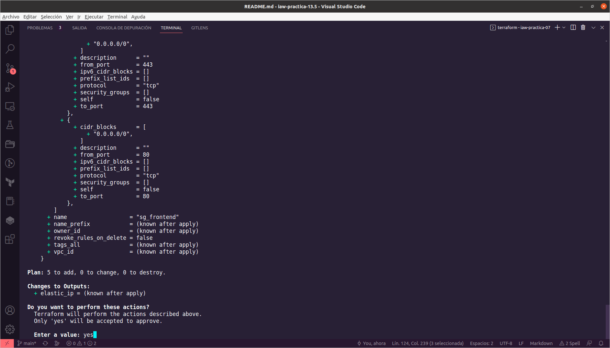

Cuando termine de ejecutarse el comando, nos mostrará el proceso que ha realizado para notificar los cambios realizados, también nos indicará la cantidad de recursos creados.

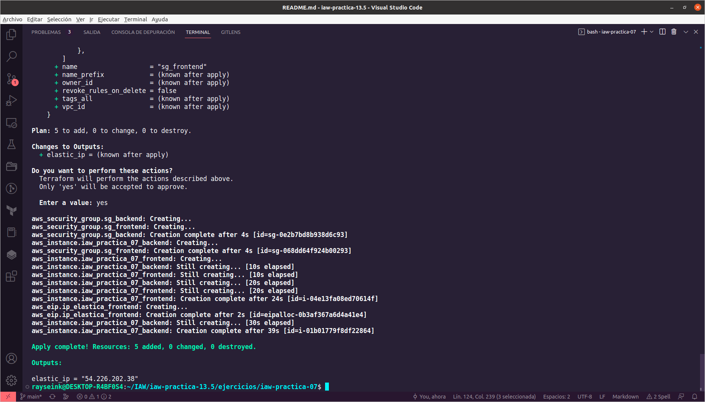

En AWS comprobaremos primero que se han creado los grupo de seguridad.

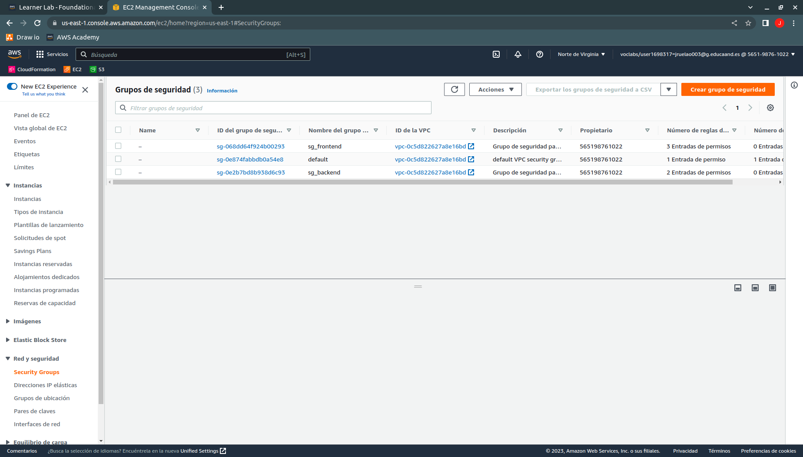

A continuación, comprobaremos que se han creado las instancias.

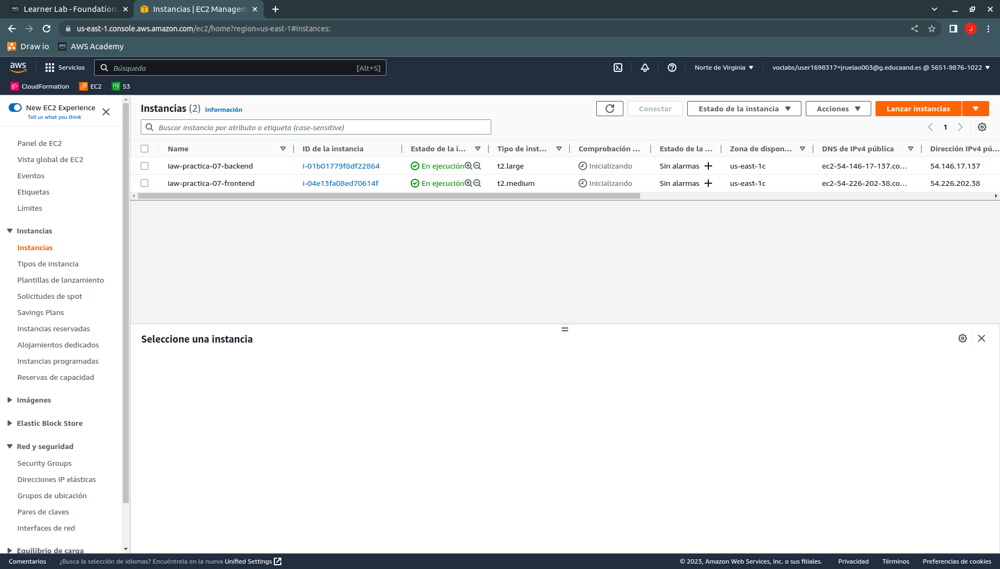

Después, comprobaremos que tenemos asignada una IP elástica a la cuenta, la misma que nos ha notificado Terraform.

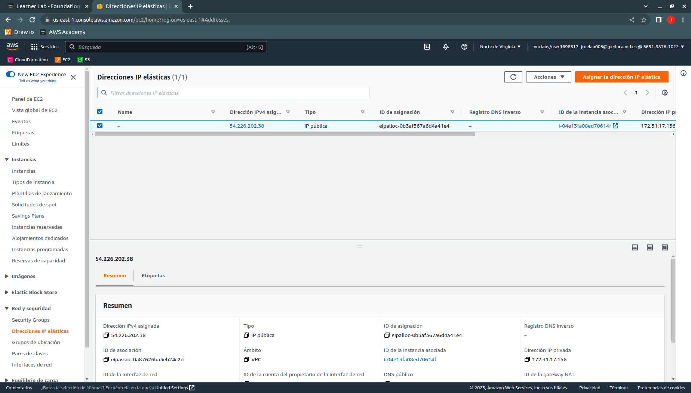

Por último, comprobaremos que la instancia que hace de frontend tiene la IP elástica asignada.

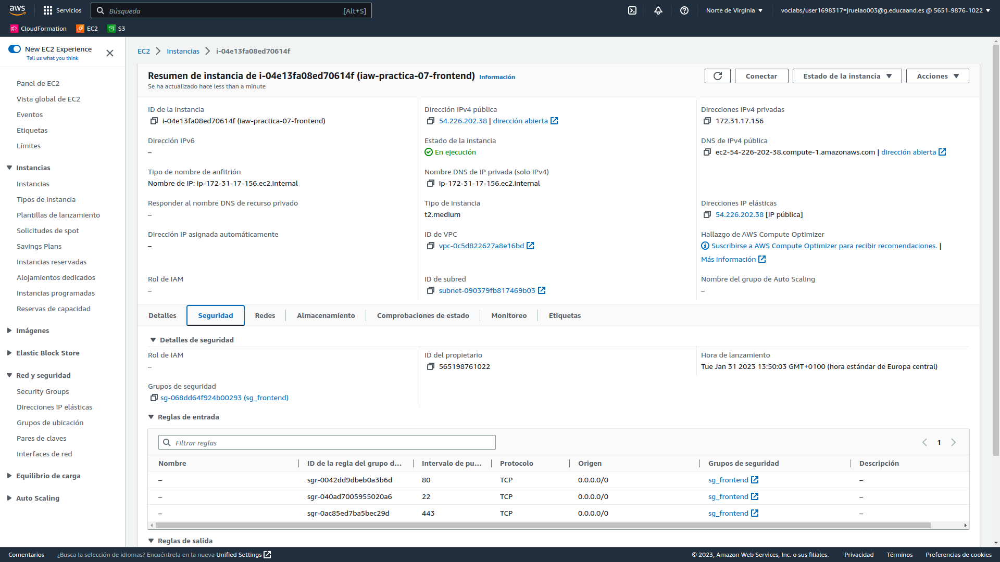

Si quisiéramos conocer el estado de la infraestructura, deberemos usar el comando:

```bash
terraform show
```

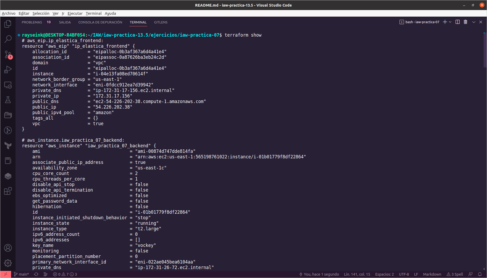

Cuando queramos eliminar la infraestructura creada, tenemos que usar el comando:

```bash
terraform destroy
```

Al igual que con el comando *terraform apply*, nos da información sobre la infraestructura que queremos eliminar y para realizar la eliminación de la infraestructura, tenemos que introducir por teclado la palabra *yes*.

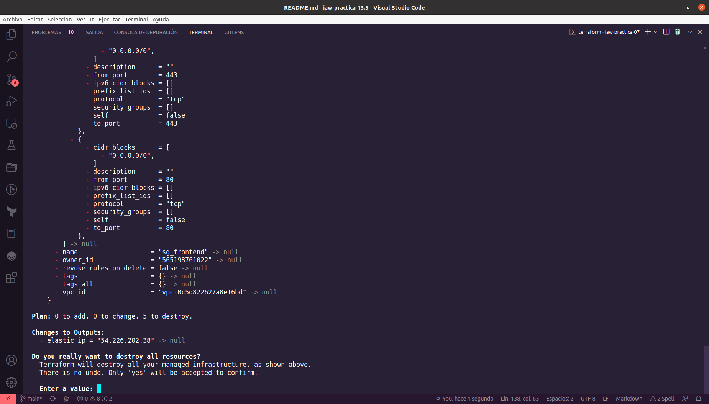

Durante la eliminación de la infraestructura, iremos viendo el progreso de eliminación.

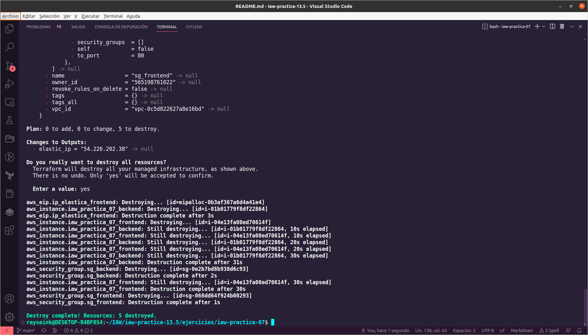

Cuando el proceso de eliminación termine, comprobaremos en AWS que se han realizado los cambios, primero los grupos de seguridad.


Después, las instancias.

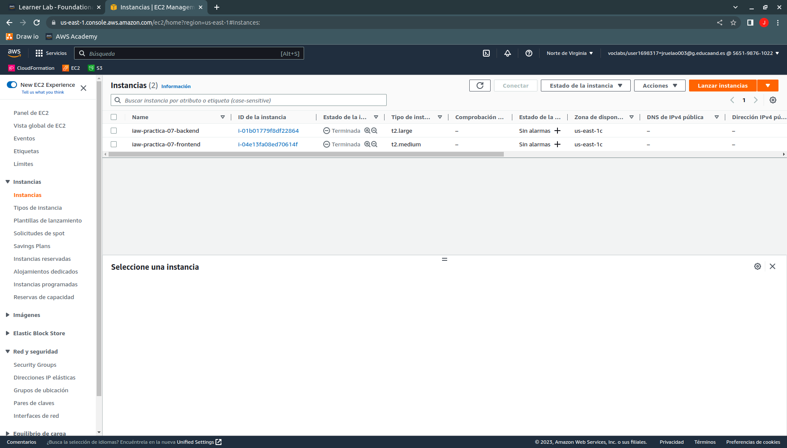

Y por último, comprobaremos la liberación de la IP elástica.


## main.tf de iaw-practica-09

En este archivo definiremos la arquitectura de un balanceador de carga con IP elástica, dos frontend, un backend y un NFS Server, de la misma forma y antes de definir las instancias, definiremos los grupos de seguridad para las instancias.

Gran parte del código anterior lo podemos reutilizar para realizar este archivo.

Al principio del archivo tendremos que definir cuál es el proveedor que vamos a usar, en este caso AWS y definir nuestra región.

```tf
provider "aws" {
  region = "us-east-1"
}
```

Después de definir el proveedor, continuaremos definiendo los grupos de seguridad, como hicimos en el archivo anterior, estableceremos que es un **recurso de tipo aws_security_group** y el nombre para el recurso. A continuación, el nombre para el grupo de seguridad y su descripción, además de las reglas de entrada, que en el caso del balanceador de carga necesita el puerto TCP de SSH (22), HTTP (80) y HTTPS (443). De igual manera crearemos los demás puertos TCP, para el grupo de seguridad de los frontend hay que abrir el puerto de SSH (22) y el de HTTP (80); para el grupo de seguridad del backend hay que abrir el de SSH y el puerto de MySQL / Aurora (3306) y por último, para el grupo de seguridad para el NFS Server hay que abrir el puerto de SSH y el de NFS (2049).

```tf
resource "aws_security_group" "sg_balancer" {
  name        = "sg_balancer"
  description = "Grupo de seguridad para los balanceadores de carga"

  ingress {
    from_port   = 22
    to_port     = 22
    protocol    = "tcp"
    cidr_blocks = ["0.0.0.0/0"]
  }

  ingress {
    from_port   = 80
    to_port     = 80
    protocol    = "tcp"
    cidr_blocks = ["0.0.0.0/0"]
  }

  ingress {
    from_port   = 443
    to_port     = 443
    protocol    = "tcp"
    cidr_blocks = ["0.0.0.0/0"]
  }
}
```

Después de los grupos de seguridad, estableceremos las instancias, comenzaremos con la del balanceador de carga. **definiremos un recurso de tipo aws_instance** y el nombre que tendrá el recurso. Dentro del recurso, estableceremos la AMI que vamos a usar, en este caso de Ubuntu Server 22.04 con 4GB de RAM, el grupo de seguridad que hemos establecido al principio del archivo, el archivo de claves que vamos a usar y el nombre para la instancia.

```tf
resource "aws_instance" "iaw_practica_09_balancer" {
  ami             = "ami-00874d747dde814fa"
  instance_type   = "t2.medium"
  security_groups = [aws_security_group.sg_balancer.name]
  key_name        = "vockey"

  tags = {
    Name = "iaw-practica-09-balancer"
  }
}
```

Por último, vamos a asociar una IP elástica a la cuenta y la asignaremos a la instancia que hará de balanceador de carga mediante el recurso "aws_eip" y usaremos el nombre del recurso de la instancia y su ID para realizar la asignación. Antes de finalizar, mostraremos la IP elástica que se asignará al balanceador de carga.

```tf
resource "aws_eip" "ip_elastica_balancer" {
  instance = aws_instance.iaw_practica_09_balancer.id
}

# Se muestra la IP elástica de la instancia frontend
output "elastic_ip" {
  value = aws_eip.ip_elastica_balancer.public_ip
}
```

### Ejecución del archivo main.tf

Como hicimos con el anterior archivo, nos situaremos sobre el directorio dónde se encuentra el archivo y prepararemos el directorio con:

```bash
terraform init
```

Una vez termine la inicialización, formatearemos el archivo mediante:

```bash
terraform fmt
```

A continuación, procederemos a crear la infraestructura que hemos definido en el archivo.

```bash
terraform apply
```

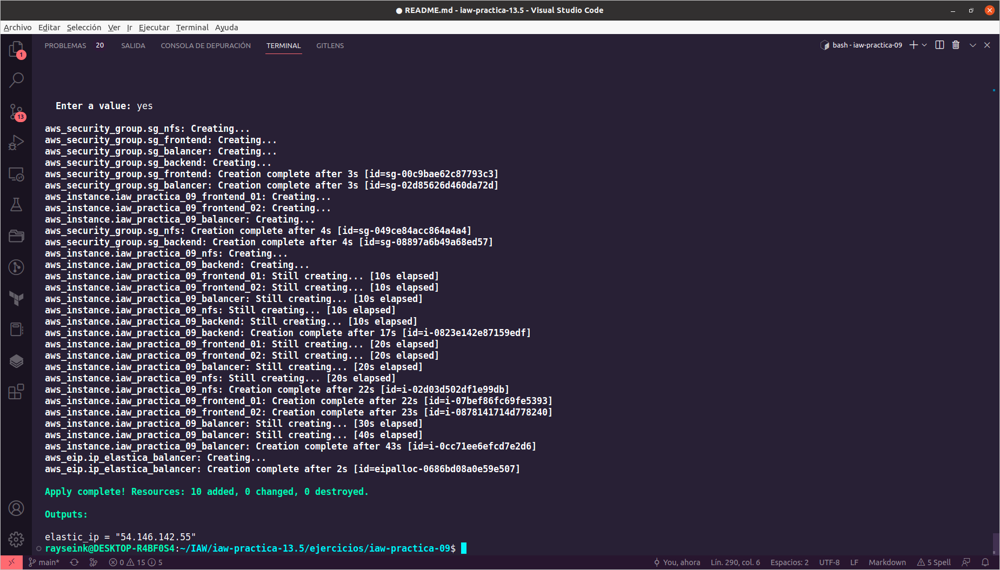

Tras la finalización de la ejecución de Terraform, comprobaremos que se han creado los grupos de seguridad.

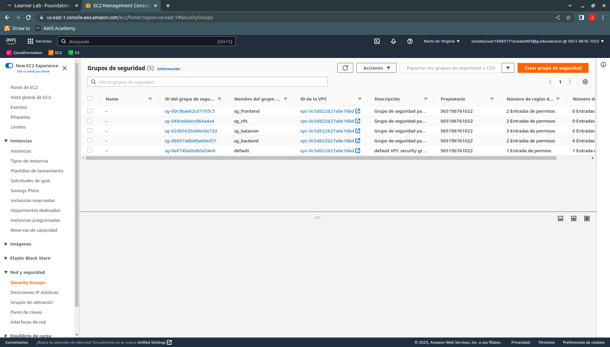

Después, comprobaremos que se han creado las instancias.

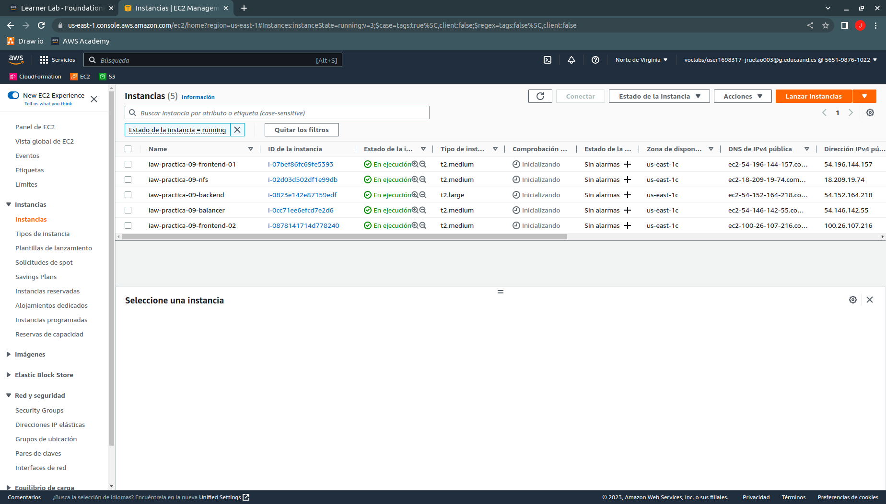

A continuación, comprobaremos la asociación de la IP elástica a la cuenta.


Por último, comprobaremos la asignación de la IP elástica a la instancia del balanceador de carga.

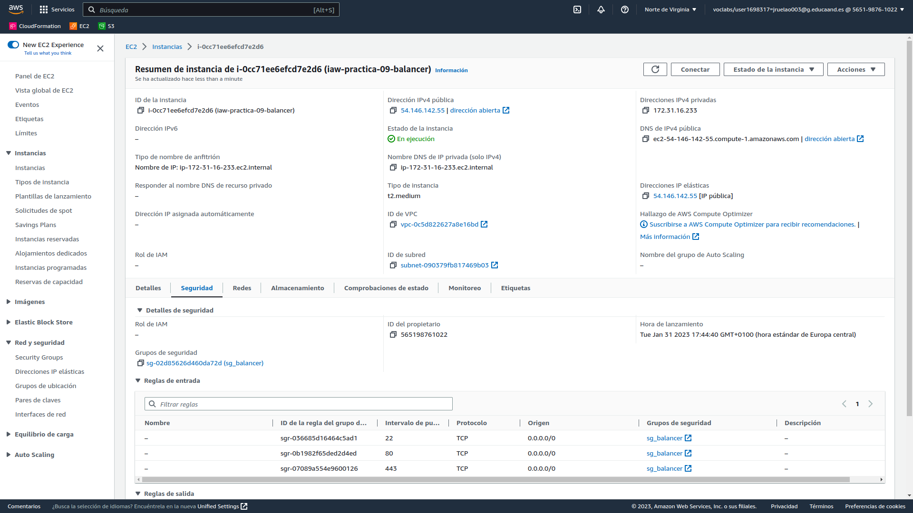

Tras comprobar que se ha creado la infraestructura, la eliminaremos con el comando:

```bash
terraform destroy
```

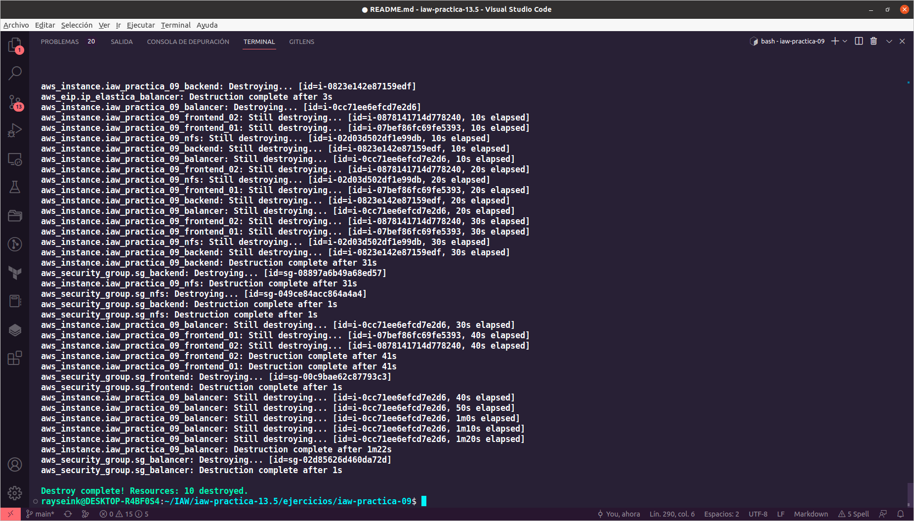

Tras la finalización de la ejecución, comprobaremos que se han borrado los grupos de seguridad.

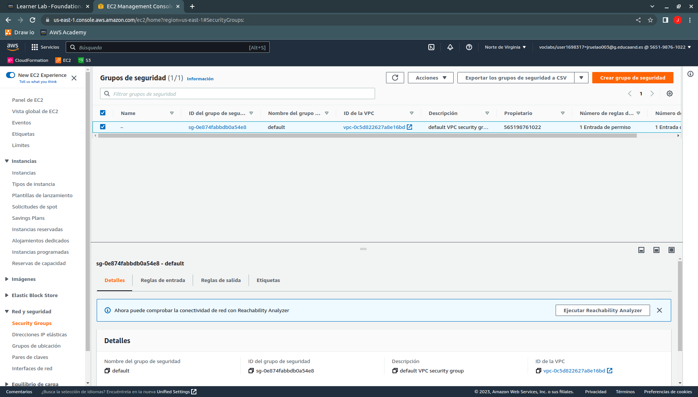

Después comprobaremos que se han eliminado las instancias.

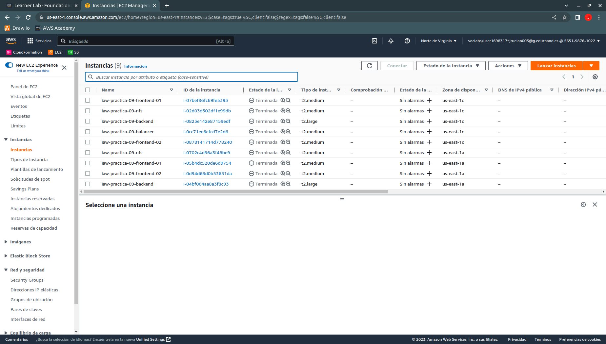

Y por último, comprobaremos que se ha liberado la IP elástica.

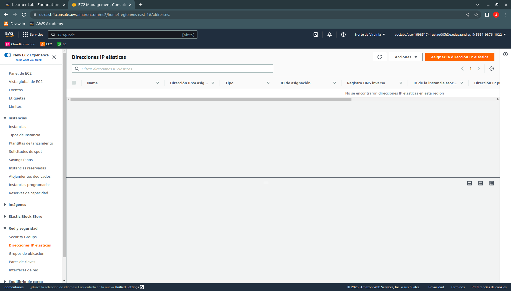
