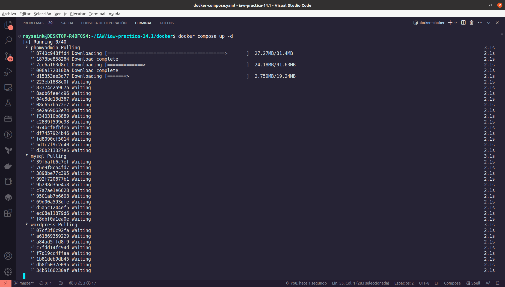
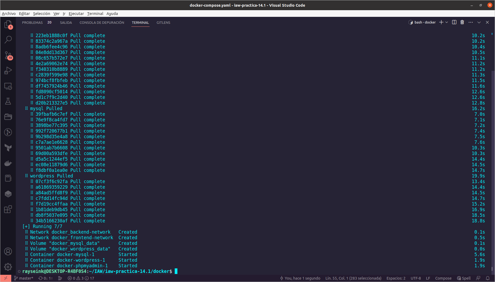
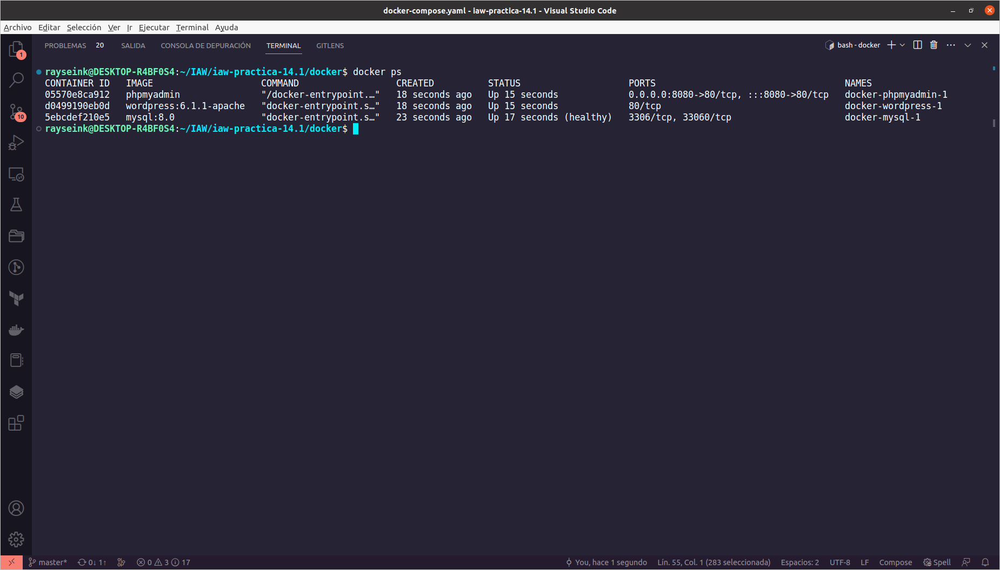
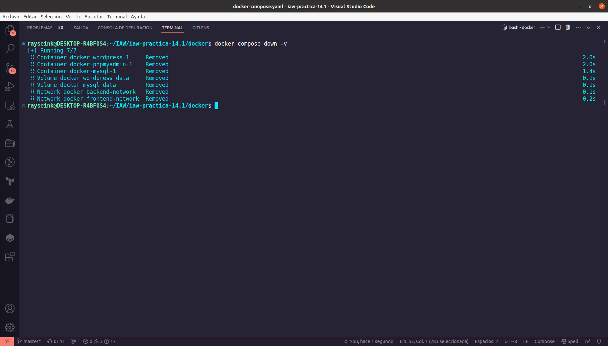
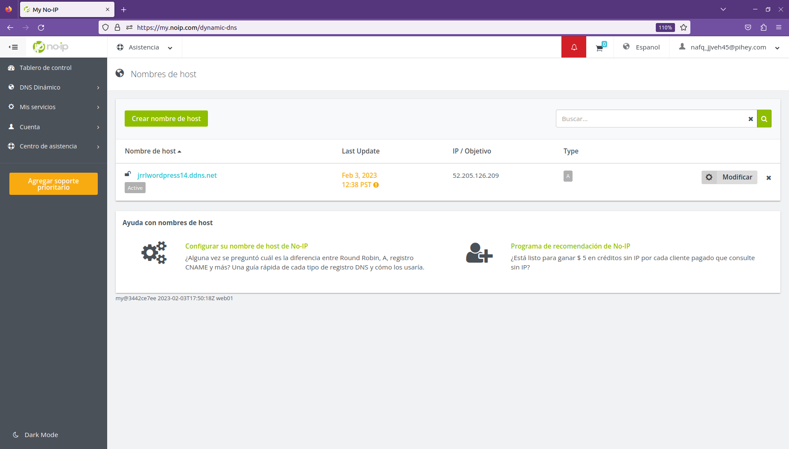
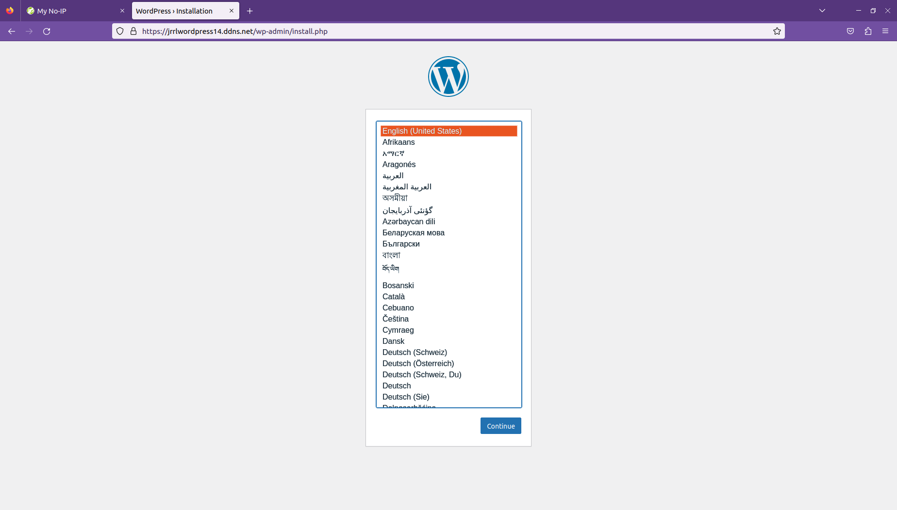
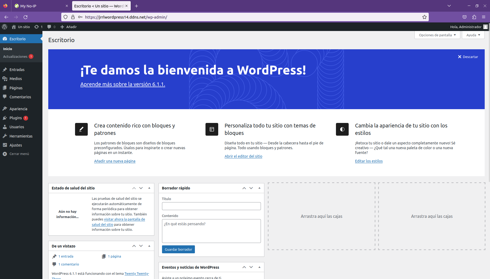
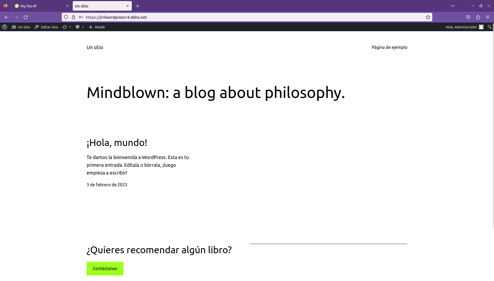
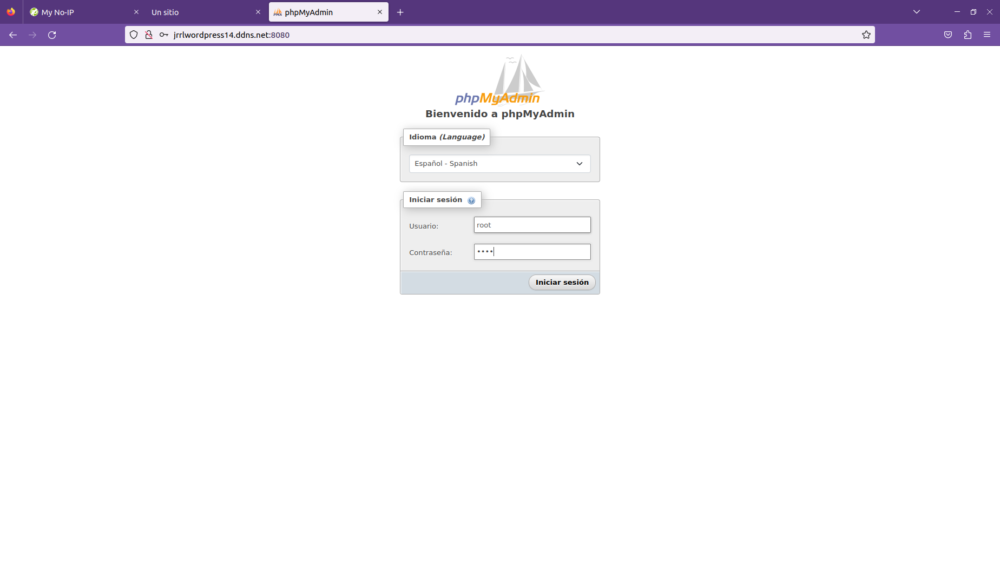
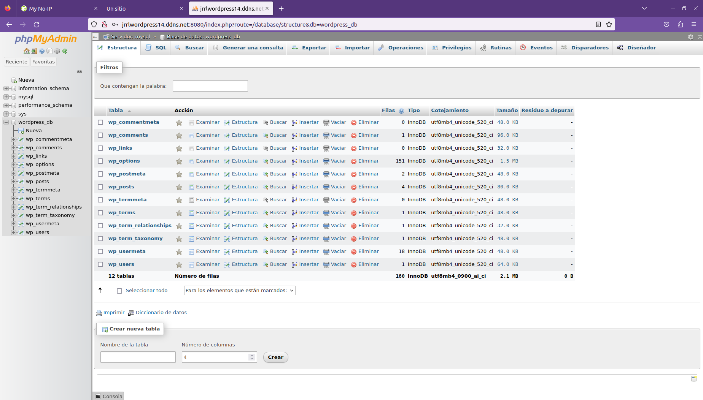

# Instalación de WordPress mediante Docker

En esta práctica **realizaremos el despliegue de un servicio de Docker Compose mediante redes virtuales y contenedores**, para ello, usaremos una instancia EC2 de AWS, **preferiblemente Ubuntu 20.04 con al menos 4GB de RAM**. Para realizar este despliegue, usaremos *Terraform* para crear el grupo de seguridad para la instancia, la instancia y la asignación de una IP elástica a la instancia. Después, mediante *Ansible* aprovisionaremos la instancia para realizar las instalaciones pertinentes, pasar los archivos para la instancia y lanzar la infraestructura.

Empezaremos creando un repositorio en GitHub :octocat: y lo clonaremos en nuestra máquina anfitrión, a continuación, prepararemos el repositorio según la siguiente estructura:

+ **ansible**
  + **inventario**
    + inventario --> archivo

  + **playbooks**
    + delete_compose.yaml

    + deploy_compose.yaml

    + install_docker.yaml

  + **vars**
    + variables.yaml

  + main.yaml

+ **docker**
  + .env

  + docker-compose.yaml

+ **terraform**
  + main.tf

  + variables.tf

## Docker Hub

Puesto que ya sabemos sobre *Ansible* y *Terraform* de prácticas anteriores, procederé a explicar en qué consiste Docker. Docker es un orquestador de contenedores, permitiendo crear contenedores virtuales mediante imágenes que se van descargando de [Docker Hub](https://hub.docker.com/), las imágenes pueden ser sistemas operativos, servicios como Apache... En **Docker Hub** podemos encontrar muchas imágenes según las necesidades que tengamos y consultar su documentación técnica para obtener información sobre dicha imagen.


Las imágenes se van almacenando en el equipo y conforme queramos las usamos para crear contenedores. También se puede crear un servicio mediante Docker Compose en el cuál podemos hacer uso de varias imágenes para crear distintos contenedores que se van ejecutando de forma conjunta para ofrecer un servicio.

## Ciclo de vida de los contenedores

Los contenedores tienen un ciclo de vida según las operaciones que vayamos haciendo con ellos y la forma en que los creamos.


## Curso de Docker

Si se quiere saber más sobre Docker, aquí dejo un enlace --> [Curso Docker](https://josejuansanchez.org/iaw/practica-docker/index.html)

## Instalación de Docker y Docker Compose

Empezaremos con la parte de Docker, por lo que **necesitaremos tener tanto Docker como Docker Compose instalados**. Docker tiene soporte para varios tipos de sistemas operativos, por lo que realizaremos la instalación correspondiente a nuestro sistema.

[Instalación de Docker](https://docs.docker.com/engine/install/)

[Instalación de Docker Compose](https://docs.docker.com/compose/install/linux/#install-the-plugin-manually)

## docker

Dentro de este directorio necesitaremos un archivo de para las variables, **.env**, y otro archivo con el que montaremos la infraestructura o la destruiremos según necesitemos, **docker-compose.yaml**.

### .env

En nuestro archivo de variable definiremos las variables que necesitamos para la parte de SQL. Definiremos cuatro variables, la primera, *MYSQL_ROOT_PASSWORD* nos permite establecer la contraseña que tendrá el usuario root para el acceso mediante phpMyAdmin. La segunda variable, *MYSQL_DATABASE*, nos permite definir la base de datos tanto para MySQL como para WordPress, la tercera variable, *MYSQL_USER*, nos permite definir el usuario que tendrá acceso a la base de datos que vamos a crear, y por último, con la variable *MYSQL_PASSWORD* estableceremos la contraseña del usuario para la base de datos. La última variable, *WORDPRESS_DOMAIN* nos permite establecer el dominio que tendrá WordPress a través de https-portal.

```
MYSQL_ROOT_PASSWORD=root
MYSQL_DATABASE=wordpress_db
MYSQL_USER=wordpress_user
MYSQL_PASSWORD=wordpress_password

WORDPRESS_DOMAIN=jrrlwordpress14.ddns.net
```

### docker-compose.yaml

En este archivo definiremos la estructura de servicios que tendrá nuestra instancia ejecutándose. **Este es el archivo principal para Docker Compose**, **por lo que siempre tendrá este nombre**, salvo por la extensión que puede ser .yaml o .yml.

En algunos servicios hay ports que están comentados ya que se han ido realizando pruebas de interconexión entre los servicios.

Empezaremos estableciendo la versión o *version*, en este caso la 3.8 según el Docker Engine (o motor de Docker) que se esté usando para la instancia, a continuación usaremos **services para definir la lista de servicios que vamos a usar**, primero empezaremos con el servicio de *WordPress*, al que pondremos un nombre acorde con su propósito, dentro del servicio, usaremos *image* para especificar la imagen y la versión de la imagen que queremos usar, **la información necesaria sobre la imagen la encontraremos en [Docker Hub](https://github.com/juanramonrueda/iaw-practica-14.1#docker-hub)**.

A continuación, definiremos las variables de entorno que necesita la imagen para funcionar correctamente,para ello, necesitamos definir dónde estará la base de datos, *WORDPRESS_DB_HOST*, el nombre de la base de datos, *WORDPRESS_DB_NAME*, el usuario que se usará en la base de datos, *WORDPRESS_DB_USER* y la contraseña que tendrá el usuario de la base de datos, *WORDPRESS_DB_PASSWORD*, para las variables de entorno usaremos las variables que hemos definido en el archivo de variables, *.env*, salvo la primera variable que hace referencia a un servicio que vamos a definir un poco más adelante.

Después, **en volumes definiremos un volumen en el que guardar los datos en nuestro equipo local que gestionará Docker**, de forma que aunque se elimine el contenedor o el servicio, los datos los tendremos intactos. **Vincularemos la variable de Docker con el directorio /var/www/html del contenedor**. En *depends_on* estableceremos el servicio o contenedor **al que habrá que esperar a que esté listo y saludable** para poder continuar con la creación de este contenedor o servicio. Por último, definiremos que el servicio se reinicie siempre según ciertas circunstancias y definiremos las redes o networks sobre las que el servicio o contenedor se ejecutará, deberá tener acceso a las dos que crearemos más adelante para poder comunicarse con el servicio de HTTPS y con la base de datos.

```yaml
version: '3.8'

services:
  wordpress:
    image: wordpress:6.1.1-apache
    # ports:
    #   - 80:80
    environment:
      WORDPRESS_DB_HOST: mysql
      WORDPRESS_DB_NAME: ${MYSQL_DATABASE}
      WORDPRESS_DB_USER: ${MYSQL_USER}
      WORDPRESS_DB_PASSWORD: ${MYSQL_PASSWORD}
    volumes:
      - wordpress_data:/var/www/html
    depends_on:
      mysql:
        condition: service_healthy
    restart: always
    networks: 
      - frontend-network
      - backend-network
```

En siguiente servicio que vamos a definir va a ser el de MySQL, **estableceremos la imagen y la versión que usaremos**, en este caso la 8.0, a continuación, estableceremos las variables que necesitamos para el servicio, *MYSQL_ROOT_PASSWORD* para la contraseña de acceso mediante root, *MYSQL_DATABASE* para establecer la base de datos, *MYSQL_USER* para establecer el usuario de la base de datos y *MYSQL_PASSWORD* para establecer la contraseña al usuario.

Después, vincularemos el volumen que gestionará Docker con la ruta en la que se guardan las bases de datos en el contenedor para evitar perderlas en el caso de que eliminemos el contenedor o servicio. Seguiremos con un proceso importante para este tipo de servicios, durante la creación del servicio o contenedor, **tenemos que tener en cuenta que este servicio es el más importante y el que permite que nuestra infraestructura funcione**, por lo que tenemos que comprobar que funciona correctamente mediante *healthcheck*, usaremos *retries* para establecer el número de intentos de comprobación del servicio, con *timeout* estableceremos el tiempo de espera de la comprobación para tratar de obtener la verificación de que el servicio funciona o no, usaremos *interval* para realizar una espera entre comprobación y comprobación para determinar el estado del servicio y mediante *test* realizaremos la comprobación de que el servicio está saludable o no.

Para ir finalizando con este servicio, estableceremos el *restart* a always para que se reinicie y que el servicio se encontrará en la *network* backend-network.

```yaml
  mysql:
    image: mysql:8.0
    environment:
      - MYSQL_ROOT_PASSWORD=${MYSQL_ROOT_PASSWORD}
      - MYSQL_DATABASE=${MYSQL_DATABASE}
      - MYSQL_USER=${MYSQL_USER}
      - MYSQL_PASSWORD=${MYSQL_PASSWORD}
    # ports:
    #   - 3306:3306
    volumes:
      - mysql_data:/var/lib/mysql
    healthcheck:
      test: mysql --user=${MYSQL_USER} --password=${MYSQL_PASSWORD} -e "SHOW DATABASES;"
      interval: 5s
      timeout: 2s
      retries: 5
    restart: always
    networks:
      - backend-network
```

Continuaremos con el siguiente servicio, phpMyAdmin, estableceremos la imagen que vamos a usar, en *ports* vincularemos el 8080 del host con el 80 del contenedor o servicio para poder conectarnos desde el exterior al servicio y administrar las bases de datos. Estableceremos una variable de entorno (*environment*) que es *PMA_HOST* para especificar dónde se encuentra el servicio de bases de datos, en el servicio mysql, que depende del (*depends_on*) servicio de mysql, que se reinicie (*restart*) siempre y que se encuentra en las redes (*networks*) frontend-network para acceder a este servicio y en backend-network para conectar con el servicio de bases de datos.

```yaml
  phpmyadmin:
    image: phpmyadmin:5.2.0-apache
    ports:
      - 8080:80
    environment:
      - PMA_HOST=mysql
    depends_on:
      mysql:
        condition: service_healthy
    restart: always
    networks:
      - frontend-network
      - backend-network
```

Para finalizar con los servicios, definiremos el servicio de https-portal que nos dará el cifrado de TLS, usaremos una imagen que no es oficial, es de un usuario, ya que en la imagen viene separada con un slash (**/**).

Estableceremos los puertos (*ports*) en los que vincularemos el servicio, el 443 del host y el 443 del servicio o contenedor y el 80 del host con el 80 del servicio. Después, crearemos un volumen para mantener los certificados que descarguemos, a continuación, haremos que se reinicie siempre que se den ciertas circunstancias y debemos definir dos variables de entorno (environment), *DOMAINS* para establecer el nombre de dominio del sitio web junto a la redirección al servicio web al puerto 80 y *STAGE* a production para que acepte conexiones entrantes. Por último, haremos que el servicio únicamente se encuentre en la red (*networks*) de frontend-network para conectar el servicio de HTTPS con el servicio web.

```yaml
  https-portal:
    image: steveltn/https-portal
    ports:
      - 80:80
      - 443:443
    volumes:
      - ssl_certs_data:/var/lib/https-portal
    restart: always
    environment:
      DOMAINS: '${WORDPRESS_DOMAIN} -> http://wordpress:80'
      STAGE: 'production'
    networks: 
      - frontend-network
```

Para ir finalizando, estableceremos los volúmenes (*volumes*) que hemos definido en cada servicio y las redes (*networks*) de cada servicio.

```yaml
volumes:
  mysql_data:
  wordpress_data:

networks:
  frontend-network:
  backend-network:
```

#### Ejecución del archivo docker-compose.yaml

Para comprobar el funcionamiento del archivo, **hay que comentar el servicio https-portal y quitar el comentario de los ports de los servicios que los tienen comentados** ya que es posible que no se pueda comprobar debido a que los ISP pueden tener varias direcciones IP englobadas en una sola mediante [NAT](https://www.xatakamovil.com/conectividad/nat-network-address-translation-que-es-y-como-funciona) y que se tenga que abrir puertos en el router para poder comprobar el funcionamiento real del archivo. ***Cuando se termine de comprobar el funcionamiento, hay que deshacer los cambios***.

Para realizar la comprobación hay que ejecutar en la ruta en la que se encuentra el archivo docker-compose.yaml:

```bash
docker compose up -d
```

Con el modificador -d haremos que se ejecuten en background o segundo plano los contenedores o servicios. Empezará el proceso de descarga de las imágenes que vamos a usar y también se empezarán a crear los recursos que hemos establecido en el archivo.



Una vez haya finalizado la ejecución del comando, veremos que se han creado los volúmenes y las redes y que los contenedores o servicios están iniciados, salvo el de https-portal que lo comenté.



Podemos comprobar los contenedores que están en ejecución usando el comando:

```bash
docker ps
```

O comprobar todos los contenedores que hay en la máquina mediante:

```bash
docker ps -a
```



Si hemos levantado los servicios o contenedores en la máquina local, para eliminarlos y eliminar también los volúmenes, usaremos:

```bash
docker compose down -v
```



## terraform

Como los servicios que hemos definido los ejecutaremos en una instancia de AWS, vamos a preparar un grupo de seguridad, una instancia con una AMI concreta y una IP elástica. **Empezaremos definiendo las variables que necesitamos para la instancia de EC2 en un archivo distinto a main.tf**.

### variables.tf

Mediante *variable* y el nombre de la variable a la que llamaremos para asignar su contenido a cada recurso, empezaremos con el nombre de la instancia, definiremos el nombre que tendrá la variable, *instance_name* y dentro tenemos *description* (opcional) para explicar lo que hace la variable, después con *type* definiremos el tipo de variable que es, string (o cadena), integer (o entero)... después, mediante *default* definiremos el contenido de la variable, en este caso el nombre que tendrá la instancia.

De esta forma estableceremos tanto la AMI de Ubuntu 20.04, la cantidad de RAM para la instancia y el archivo de claves que usaremos para conectar mediante SSH.

```tf
variable "instance_name" {
  description = "Nombre de la instancia de AWS"
  type        = string
  default     = "iaw-practica-14.1-docker"
}

variable "instance_ami" {
  description = "ID de la AMI de Ubuntu Server 20.04 LTS"
  type        = string
  default     = "ami-0778521d914d23bc1"
}

variable "ram_instance" {
  description = "Cantidad de RAM que se asigna a la instancia"
  type        = string
  default     = "t2.medium"
}

variable "key_file_name" {
  description = "Nombre del archivo de claves SSH"
  type        = string
  default     = "vockey"
}
```

### main.tf

En este archivo definiremos el recurso de tipo grupo de seguridad para establecer, el recurso de tipo instancia y el recurso de tipo elastic IP para que nuestros servicios de Docker Compose funcionen correctamente.

Como de costumbre, estableceremos el *provider* o proveedor que vamos a usar, en este caso aws y la *region* o región sobre la que estamos trabajando. Definiremos el recurso *aws_security_group* junto al nombre del recurso, *sg_docker*. Dentro del recurso estableceremos el *name* o nombre del grupo de seguridad y su description o descripción. Después, estableceremos las reglas de entrada (*ingress*) y de salida (*egress*) que necesita el grupo de seguridad, necesitamos que el grupo de seguridad tenga acceso por el puerto de SSH (22), de HTTP (80), de HTTPS (443) y por el puerto 8080, además de salir por cualquier puerto o protocolo. Como los puertos de entrada los vimos en prácticas anteriores, procederé a explicar la regla de salida.

La regla de salida la establecemos mediante *egress* y dentro de las llaves tenemos que poner tanto *from_port* como *to_port* a 0 para que sea cualquier puerto de salida, después en *protocol* lo pondremos a "-1" para que sea cualquier protocolo de salida y por último el *cidr_blocks* a "0.0.0.0/0" para que salga a cualquier IP.

```tf
provider "aws" {
  region = "us-east-1"
}

resource "aws_security_group" "sg_docker" {
  name        = "sg_docker"
  description = "Grupo de seguridad para una instancia con Docker"

  ingress {
    from_port   = 22
    to_port     = 22
    protocol    = "tcp"
    cidr_blocks = ["0.0.0.0/0"]
  }

  ingress {
    from_port   = 80
    to_port     = 80
    protocol    = "tcp"
    cidr_blocks = ["0.0.0.0/0"]
  }

  ingress {
    from_port   = 443
    to_port     = 443
    protocol    = "tcp"
    cidr_blocks = ["0.0.0.0/0"]
  }

  ingress {
    from_port   = 8080
    to_port     = 8080
    protocol    = "tcp"
    cidr_blocks = ["0.0.0.0/0"]
  }

  egress {
    from_port   = 0
    to_port     = 0
    protocol    = "-1"
    cidr_blocks = ["0.0.0.0/0"]
  }
}
```

Continuaremos estableciendo el recurso para la instancia, esta parte también la hemos visto, salvo por el uso de variables que es lo que explicaré a continuación.

Una vez hayamos establecido el tipo de recurso y su nombre, para llamar a la variable que contiene el ID de la AMI de Ubuntu Server 20.04, tenemos que usar *var* seguido con un dot (o punto) al nombre de la variable que contiene la AMI. De esta forma definiremos los parámetros con las variable que hemos definido en el archivo de variables.

```tf
resource "aws_instance" "iaw_practica_14_docker" {
  ami             = var.instance_ami
  instance_type   = var.ram_instance
  security_groups = [aws_security_group.sg_docker.name]
  key_name        = var.key_file_name

  tags = {
    Name = var.instance_name
  }
}

resource "aws_eip" "ip_elastica_docker" {
  instance = aws_instance.iaw_practica_14_docker.id
}
```

## ansible

Crearemos dos playbooks para realizar la instalación de Docker y Docker Compose, copiar el directorio de docker a la instancia y lanzar los servicios que hemos creado.

De hecho, dos playbooks necesitan un módulo para instalar funcionalidades de Docker Compose, por lo que realizaremos la instalación de la colección necesaria para esta parte:

```bash
ansible-galaxy collection install community.docker
```

### inventario

Empezaremos agregando el contenido a este archivo que se encuentra en el directorio inventario, *como de momento no sabemos la IP que tendrá la instancia*, *dejaremos en blanco la IP del grupo docker* y definiremos los demás parámetros.

```yaml
[docker]


[all:vars]
ansible_user=ubuntu
ansible_ssh_private_key_file=/home/rayseink/claves/vockey.pem
ansible_ssh_common_args='-o StrictHostKeyChecking=accept-new'
```

### variables.yaml

En el archivo de variables definiremos cuatro grupos, uno para el usuario, *User* junto a una variable (*Directory*) con la ruta de su directorio personal y otra variable (*Name_Group*) con el nombre del usuario y su grupo. El segundo grupo, *Type_Install* nos permitirá establecer el tipo de instalación de Docker Compose en la instancia, para un único usuario (*User_Home*) o para todos los usuarios (*Multi_User_Directory*). A continuación, con el tercer grupo, *Compose_File*, estableceremos el nombre del archivo de descarga de Docker Compose al nombre que debe tener (*New_Name*) y la ruta local de los archivos de Docker Compose que se encuentran en el equipo local. Por último, estableceremos el cuarto grupo, (*Docker*), con el nombre del paquete de instalación de Docker (*Package*), el grupo de Docker (*Group*) y el nombre del servicio (*Service*).

```yaml
User:
  Directory: /home/ubuntu
  Name_Group: ubuntu

Type_Install:
  User_Home: /home/ubuntu/.docker/cli-plugins
  Multi_User_Directory: /usr/local/lib/docker/cli-plugins

Compose_File:
  New_Name: docker-compose
  Local_Files: ../../docker

Docker:
  Package: docker.io
  Group: docker
  Service: docker.service
```

### main.yaml

En este archivo definiremos los playbooks que queremos ejecutar, en nuestro caso tendremos tres playbooks, uno para preparar la instancia con Docker, Docker Compose y los archivos (*install_docker.yaml*), el segundo para desplegar la infraestructura (*deploy_docker_compose.yaml*) y el último para eliminar el despliegue (*delete_docker_compose.yaml*).

Cada playbook tiene una condición (*when*) que hay que pasar mediante el modificador **--extra-vars** para poder ejecutarse, ya que el caso de que no tuvieran dicha condición, se ejecutarían todos los playbooks en orden y cuando terminasen su ejecución, no tendríamos infraestructura ya que estaría borrada por el último playbook, por esa misma razón tenemos que usar condiciones de ejecución para ejecutar los playbooks que nos interesan.

```yaml
---

- name: Instalación de Docker y Docker Compose
  ansible.builtin.import_playbook: playbooks/install_docker.yaml
  when: instalar | d(False) == "docker"

- name: Despliegue de Docker Compose
  ansible.builtin.import_playbook: playbooks/deploy_compose.yaml
  when: desplegar | d(False) == "compose"

- name: Eliminación del despliegue de Docker Compose
  ansible.builtin.import_playbook: playbooks/delete_compose.yaml
  when: borrar | d(False) == "compose"
```

### install_docker.yaml

En este playbook realizaremos la instalación de Docker y Docker Compose, además de pasar el directorio local *docker* a la instancia para realizar la ejecución del archivo docker-compose.yaml.

Empezaremos con las tasks y la primera tarea a realizar es la inclusión del archivo de variables, a continuación continuaremos con la actualización de repositorios y con la instalación del paquete *docker.io* debido a que es el paquete de Docker para servidores.

```yaml
  tasks:
    - name: Inclusión del archivo de variables
      ansible.builtin.include_vars: ../vars/variables.yaml

    - name: Actualización de repositorios
      ansible.builtin.apt:
        update_cache: true

    - name: Instalación de Docker
      ansible.builtin.apt:
        name: "{{ Docker.Package }}"
        state: present
```

Dependiendo de cómo queramos realizar la instalación Docker Compose, seleccionaremos un método u otro, en mi caso seguiré el método de instalación para un único usuario, por lo que tengo que preparar un directorio en el directorio personal del usuario *ubuntu* y otorgar los permisos y el propietario y el grupo para el directorio que hay que crear para el archivo de Docker Compose. Después hay que realizar la descarga del archivo de Docker Compose en el directorio que se ha creado en el directorio personal del usuario cambiando el nombre del archivo de descarga al requerido. Por último, asignaremos el grupo docker al usuario mediante el módulo *ansible.builtin.user*, especificando al usuario, el grupo y en *append a true* para agregarlo ya que de no poner la línea no lo agregaría.

```yaml
    - name: Creación de directorio para Docker Compose
      ansible.builtin.file:
        path: "{{ Type_Install.User_Home }}"
        mode: 0775
        owner: "{{ User.Name_Group }}"
        group: "{{ User.Name_Group }}"
        state: directory

    - name: Descarga de Docker Compose
      ansible.builtin.get_url:
        url: https://github.com/docker/compose/releases/download/v2.15.1/docker-compose-linux-x86_64
        dest: "{{ Type_Install.User_Home }}/{{ Compose_File.New_Name }}"
        mode: 0775
        owner: "{{ User.Name_Group }}"
        group: "{{ User.Name_Group }}"

    - name: Asignación del grupo Docker al usuario
      ansible.builtin.user:
        name: "{{ User.Name_Group }}"
        groups: "{{ Docker.Group }}"
        append: true
```

Para poder ejecutar Docker Compose desde Ansible necesitaremos instalar el gestor de paquetes de Python e instalar mediante PIP el módulo docker y docker-compose para poder ejecutar de forma remota los archivos de Docker Compose.

```yaml
    - name: Instalación del gestor de paquetes de Python
      ansible.builtin.apt:
        name: python3-pip
        state: present

    - name: Instalación de Docker para Python
      ansible.builtin.pip:
        name: docker
        state: present

    - name: Instalación de Docker Compose para Python
      ansible.builtin.pip:
        name: docker-compose
        state: present
```

Para ir finalizando, cambiaremos los permisos del archivo *docker.sock* que se encuentra en */var/run* para poder ejecutar tanto Docker como Docker Compose sin problemas, después reiniciaremos el servicio de Docker y copiaremos los archivos locales a la instancia para poder desplegar nuestro archivo docker-compose.yaml cambiando los permisos 

```yaml
    - name: Cambio de permisos para el directorio /var/run/docker.sock
      ansible.builtin.file:
        path: /var/run/docker.sock
        mode: 0777

    - name: Reinicio de Docker para actualizar el grupo del usuario
      ansible.builtin.service:
        name: "{{ Docker.Service }}"
        state: restarted

    - name: Copiado del directorio docker local a la instancia
      ansible.builtin.copy:
        src: "{{ Compose_File.Local_Files }}"
        dest: "{{ User.Directory }}"
        mode: 0775
        owner: "{{ User.Name_Group }}"
        group: "{{ User.Name_Group }}"
```

### deploy_compose.yaml

Este playbook únicamente servirá para lanzar la infraestructura ya que si juntamos la instalación de Docker y Docker Compose junto a su ejecución y ya tenemos la instancia aprovisionada, tardaremos más en lanzar la ejecución del archivo y será una pérdida de tiempo.

Usando el módulo que he comentado al principio de la parte de Ansible, ejecutaremos el Docker Compose en la instancia para levantar los servicios, con *project_src* indicaremos la ruta en la que se encuentran los archivos, con *files* especificaremos los archivos que queremos ejecutar con *state present* para indicar que es *docker compose up -d* y usaremos el socket de Docker para realizar la ejecución del archivo mediante *docker_host*.

```yaml
  tasks:
    - name: Ejecución de la infraestructura
      community.docker.docker_compose:
        project_src: docker
        files:
          - docker-compose.yaml
        state: present
        docker_host: unix:///var/run/docker.sock
```

### delete_compose.yaml

Al igual que con el anterior archivo, este tiene que estar separado por razones obvias y que he comentado antes.

Como hemos hecho antes, indicaremos la ruta en la que se encuentran los archivos mediante *project_src*, los archivos que hay que ejecutar con *files* y en este caso *state absent* para indicar que es *docker compose down -v* y usaremos el socket de Docker para realizar la ejecución con *docker_host*, también añadiremos *remove_images* para borrar las imágenes (opcional) y *remove_volumes* para borrar los volúmenes (también es opcional).

```yaml
  tasks:
    - name: Eliminación de la infraestructura
      community.docker.docker_compose:
        project_src: docker
        files:
          - docker-compose.yaml
        state: absent
        # remove_images: all
        # remove_volumes: true
        docker_host: unix:///var/run/docker.sock
```

## Ejecución de los archivos

Iniciaremos el laboratorio de AWS y **obtendremos las nuevas claves que pondremos en el archivo credentials de .aws**.

Primero procederemos a situarnos en el directorio de Terraform y ejecutaremos:

```bash
terraform apply -auto-approve
```

Cuando termine de nos mostrará la IP elástica que se ha asignado a la instancia, esa IP elástica la pondremos en el archivo inventario de Ansible y lo guardaremos, después nos situaremos en el directorio de Ansible y ejecutaremos:

```bash
ansible-playbook -i inventario/inventario main.yaml --extra-vars "instalar=docker desplegar=compose"
```

De esta forma ejecutaremos únicamente los dos primeros playbooks, el playbook de instalación de Docker y Docker Compose junto a la preparación del entorno y el playbook de ejecución del archivo de docker-compose.yaml. Mientras termina, pondremos en [No-IP](https://www.noip.com/es-MX) el dominio que hemos asignado en el archivo docker-compose.yaml al servicio https-portal junto a la IP elástica de la instancia de AWS.



Cuando termine la ejecución de Ansible, esperaremos unos minutos a que todos los servicios o contenedores estén completamente listos, ya que el servicio https-portal suele tardar un poco más en estar preparado. Cuando hayamos esperado varios minutos, usaremos el nombre de dominio y lo pondremos en un navegador web y accederemos a la instalación de WordPress.



Realizaremos la instalación de WordPress y comprobaremos que podemos acceder al back-Office de WordPress.



También comprobaremos el frontend de WordPress.



Para ir finalizando las comprobaciones, accederemos a phpMyAdmin, usaremos el nombre de dominio y usaremos el *colon* (o dos puntos) junto al puerto 8080. Pondremos el usuario *root* y la contraseña que hayamos asignado al usuario.

```
jrrlwordpress14.ddns.net:8080
```



Iremos a la base de datos que hemos creado y veremos que se han creado varias tablas.


